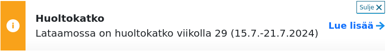

# Usage

~~~
import { useTranslation } from 'react-i18next';

...
const { t, i18n } = useTranslation();
t('translation_key');
...
i18n.changeLanguage('en');
...
~~~

## Tiedotusbannerin näyttäminen

Tiedotusbannerin saa näkyville, jos seuraavilla tekstitysavaimilla on sisältöä:

~~~
crisis_banner_heading
crisis_banner_content
crisis_banner_link_location
crisis_banner_link_label
~~~

- **HUOM**: aseta myös ruotsin- ja englanninkieliset avaimet jotta banneri näkyy kaikilla kielillä.
- **HUOM1**: ilmaise `crisis_banner_content`:ssa asia korkeintaan
  muutamalla lauseella.

### Esimerkki

Lisätään suomenkielinen versio:

~~~
...
  "crisis_banner_heading": "Huoltokatko",
  "crisis_banner_content": "Lataamossa on huoltokatko viikolla 29 (15.7.
- 21.7.2024)",
  "crisis_banner_link_location": "https://helsinki.fi",
  "crisis_banner_link_label": "Lue lisää"
...
~~~

